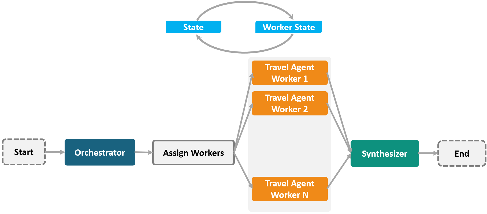
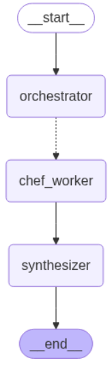

# TripAgents:Multi-Agent AI Orchestration for Travel Planner

> A sophisticated **multi-agent AI workflow** using LangGraph and LangChain to transform a list of travel destinations into a structured, detailed itinerary.

---

## Overview

**TripAgents** is an intelligent **multi-agent system** that demonstrates how autonomous AI agents can collaborate to generate comprehensive travel plans.  

The system leverages **LangGraph** to orchestrate multiple agents:  

1. **Orchestrator Agent**: Breaks down a list of destinations into structured sections with `Destination` objects.  
2. **Travel Agent Workers**: Generate detailed day-by-day itineraries and activity recommendations for each destination.  
3. **Synthesizer Agent**: Aggregates all itineraries into a polished, cohesive travel guide.  

The project highlights **multi-agent orchestration, structured LLM reasoning, and workflow automation**.

---

## Agent Architecture

| Agent | Role | Description |
|:------|:------|:------------|
| **Orchestrator Agent** | Planner | Decomposes user input into structured `Destination` objects with name, region, and activities. |
| **Travel Agent Worker** | Executor | Generates detailed itineraries and travel tips for each destination. Multiple workers run concurrently using the `Send()` API. |
| **Synthesizer Agent** | Aggregator | Combines all generated itineraries into a final travel guide. |

---
## Orchestration Design Pattern

Below is the Orchestration Design Pattern diagram for the TripAgents workflow:

<p align="center">
  
</p>

---

## Tech Stack

| Layer | Technology | Purpose |
|:------|:------------|:--------|
| AI Core | [LangChain](https://python.langchain.com/) | Prompting, LLM orchestration |
| Workflow Engine | [LangGraph](https://langchain-ai.github.io/langgraph/) | Multi-agent workflow management |
| Schema Validation | [Pydantic](https://docs.pydantic.dev/) | Structured output validation (`Destination`, `Destinations`) |
| LLM Provider | [OpenAI GPT-4o-mini](https://platform.openai.com/docs/) | Cost-effective LLM for structured reasoning |
| Visualization | [PyGraphviz](https://pygraphviz.github.io/) | Workflow diagram generation |

---

## Installation

Clone the repository:

```bash
git clone https://github.com/Azihadadi/TripAgents.git
cd TripAgents
```
---

## Install dependencies:
```bash
pip install -r requirements.txt
```
---

## Usage Example
```bash
from pprint import pprint

# Dummy input: list of travel destinations
dummy_state = {
    "destinations": "Paris, Tokyo, and New York",
    "sections": [],
    "completed_plan": [],
    "final_travel_guide": ""
}

# Execute the workflow
report = orchestrator_worker.invoke(dummy_state)

# Print the final travel guide
print("===== Final Travel Guide =====")
pprint(report["final_travel_guide"])

```
---

## Workflow Visualization
Below is the generated LangGraph agent workflow:

<p align="center">  </p>

---

## Key Highlights
- **Multi-Agent Collaboration** — Orchestrates autonomous AI agents with distinct responsibilities.

- **Parallel Execution** — Travel Agent Workers run concurrently for efficiency.

- **Structured Output** — Enforces JSON schema consistency with Pydantic.

- **Composable Architecture** — Easily extendable to other domains like finance, education, or research.

- **Reflection Pattern** — Enables iterative refinement and adaptation

---

## Example Output
```bash
Hello! I’m Anna Smith, a travel agent specialized in France.

Destination: Paris
Activities:
1. Visit the Eiffel Tower at sunrise.
2. Explore the Louvre Museum.
3. Enjoy a Seine river cruise.

Tips:
- Buy museum tickets online in advance.
- Try local bakeries for breakfast.
```


